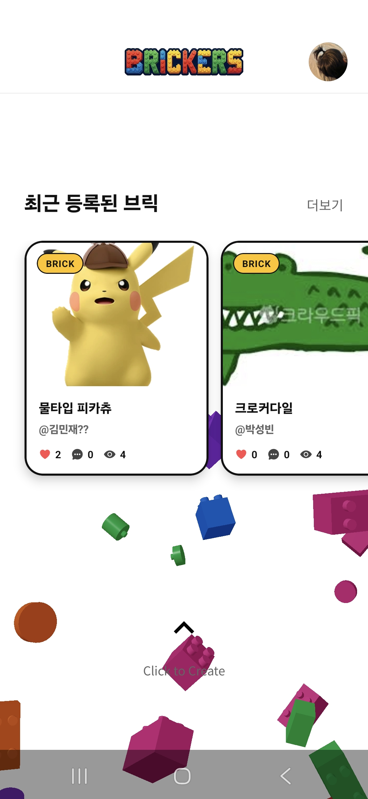
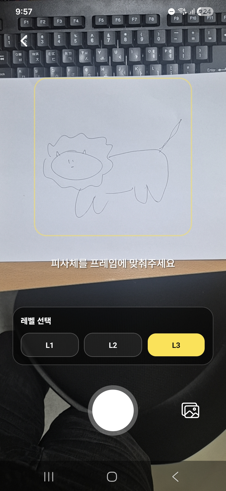
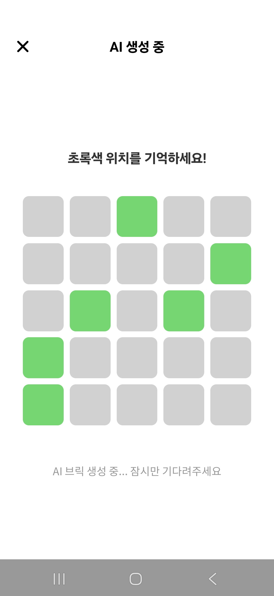
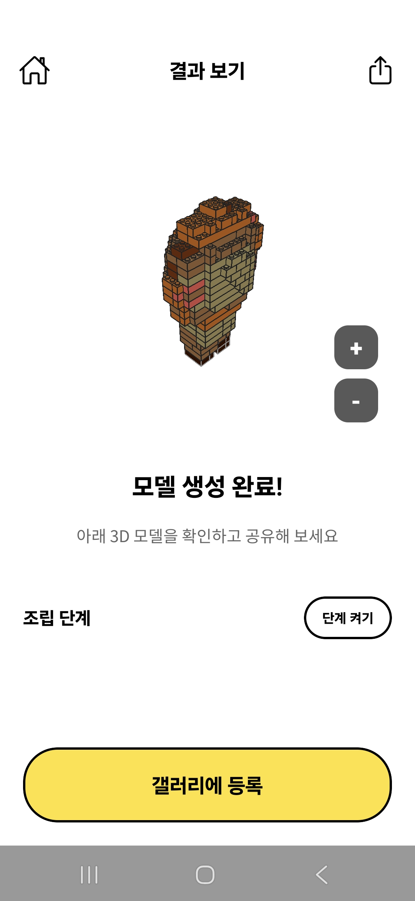
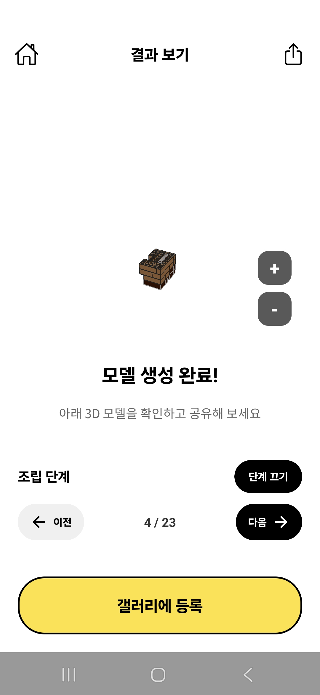
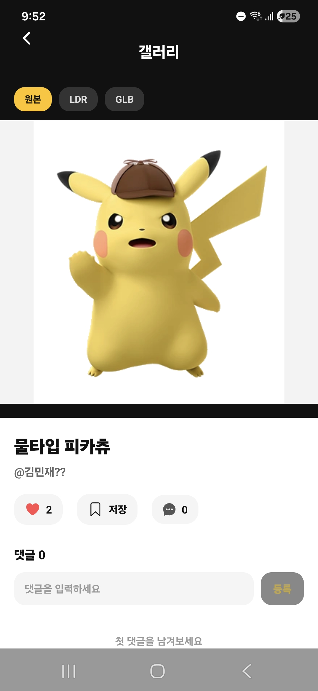
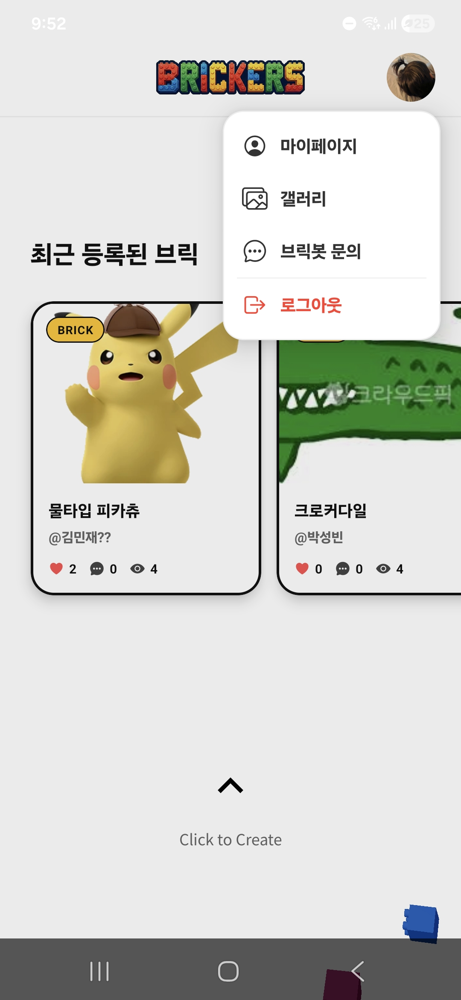
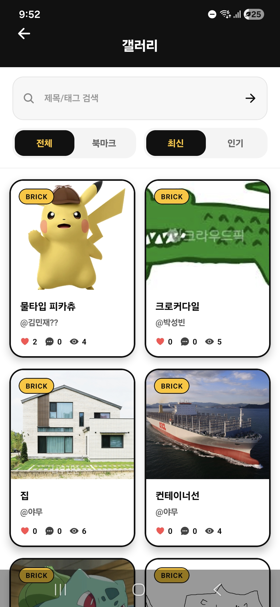
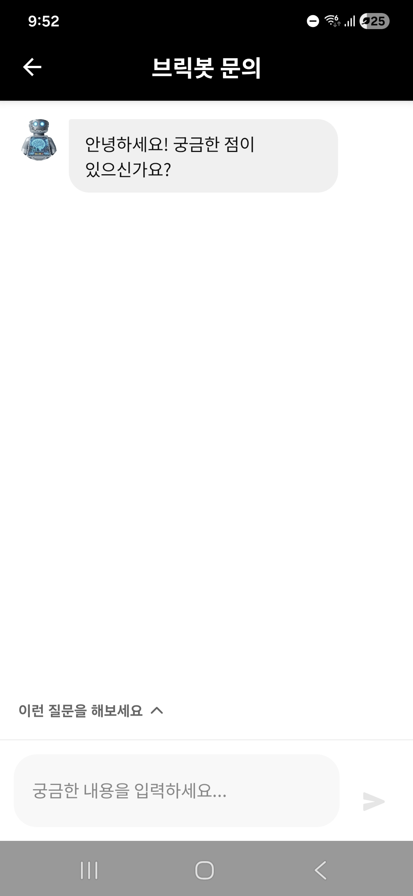

# Brickers App 🧱

Brickers App은 3D 모델을 레고 스타일의 브릭 조립 설명서로 변환해주는 모바일 애플리케이션입니다. AI 기반의 브릭 생성 프로세스, 대기 시간 동안 즐기는 미니게임, 그리고 커뮤니티 갤러리 기능을 제공합니다.

## 📱 주요 기능

### 1. 직관적인 메인 및 로그인
깔끔한 인터페이스로 시작하는 로그인부터 메인 대시보드까지의 흐름을 경험해보세요.
- **로그인**: 개인 브릭 작업 공간으로 안전하게 접속합니다.
- **메인**: AI 생성 기능과 최근 프로젝트에 빠르게 접근할 수 있습니다.

| 로그인 화면 | 메인 대시보드 |
| :---: | :---: |
|  |  |

---

### 2. AI 생성 및 업로드
3D 모델(GLB)을 쉽게 업로드하고 생성 파라미터를 설정하세요.
- **업로드**: 변환할 3D 모델을 선택합니다.
- **생성 설정**: 연령별 브릭 예산과 디테일 수준을 설정하여 완벽한 창작물을 만듭니다.

| 모델 업로드 | 생성 설정 |
| :---: | :---: |
|  |  |

---

### 3. 인터랙티브 로딩 (미니게임) 🎮
지루하게 기다리지 마세요! AI 서버가 로직을 처리하는 동안, 기기의 틸트 센서를 이용한 3단계 미로 탈출 게임을 즐길 수 있습니다.

| 로딩 및 게임 화면 |
| :---: |
|  |

---

### 4. 생성 결과 및 조립 단계
3D 모델이 브릭으로 변환된 결과를 확인하고, 단계별 3D 조립 가이드를 따라해보세요.
- **브릭 결과**: 복셀화된 아름다운 3D 브릭 모델 뷰를 제공합니다.
- **조립 스텝**: 각 브릭이 배치될 위치를 정확히 보여주는 인터랙티브 3D 가이드입니다.

| 브릭 생성 완료 | 단계별 조립 가이드 |
| :---: | :---: |
|  |  |

---

### 5. 커뮤니티 갤러리 및 탐색
다른 사용자들이 만든 작품을 구경하고 카테고리별로 필터링해보세요.
- **커뮤니티 갤러리**: 사용자들이 공유한 다양한 모델들을 모아봅니다.
- **카테고리**: 동물, 차량, 건물 등 특정 테마별로 브라우징할 수 있습니다.
- **전체 갤러리**: Brickers 월드의 모든 작품을 무한 스크롤로 탐색합니다.

| 갤러리 화면 | 카테고리 선택 | 전체 갤러리 |
| :---: | :---: | :---: |
|  |  |  |

---

### 6. AI 어시스턴트: BrickBot 🤖
조립에 대해 궁금한 점이 있거나 도움이 필요하신가요? 저희의 전담 AI 비서 BrickBot에게 물어보세요.

| BrickBot 채팅 |
| :---: |
|  |

---

### 7. 마이페이지 (My Page)
내 프로필을 관리하고, 내 컬렉션과 즐겨찾기(북마크)한 작품들을 한눈에 확인하세요.

| 마이페이지 |
| :---: |
|  |

---

## 🚀 시작하기

1. 네이티브 디렉토리로 이동: `cd brickers-native`
2. 의존성 설치: `npm install`
3. 앱 실행: `npx expo start`

